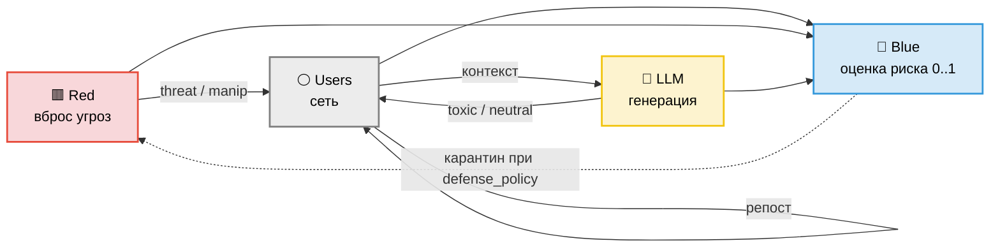
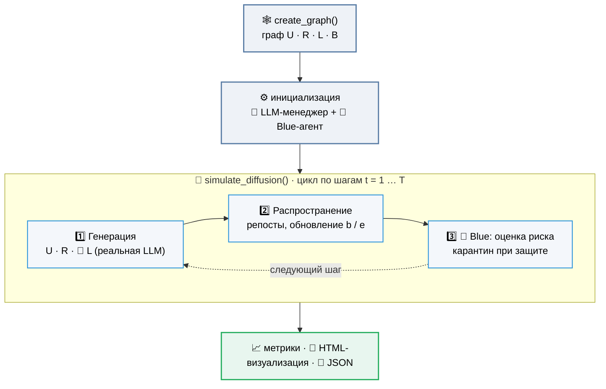

<div align="center">

# 🕸️ Мультиагентная симуляция диффузии<br/>информационно-кибернетических угроз

**Как деструктивный контент расходится по социальному графу — и что может остановить его**

<p>
  
  
  
  
</p>

<table>
<tr>
  <td align="center">⚪ <b>U</b> — Users</td>
  <td align="center">🟥 <b>R</b> — Red (атака)</td>
  <td align="center">🔺 <b>L</b> — LLM</td>
  <td align="center">🔷 <b>B</b> — Blue (защита)</td>
</tr>
</table>

</div>

Агентная модель распространения информации в социальной сети, где рядом с обычными
пользователями действуют **вредоносные агенты**, **LLM-генераторы контента** и
**модератор-детектор**. Модель позволяет измерять, как деструктивный контент
каскадно расходится по графу, как меняются мнения и эмоции аудитории, и насколько
эффективна защита — вплоть до контрфактуала «с защитой / без».

Проект создан для исследований в области безопасности LLM и информационно-кибернетических
угроз: распространение токсичного/манипулятивного контента, оценка риска сообщений с
помощью LLM и объяснимого ИИ, сравнение сценариев атаки и защиты.

---

## 📑 Содержание

- [Идея модели](#-идея-модели)
- [Типы узлов](#-типы-узлов)
- [Архитектура](#-архитектура)
- [Математическая модель](#-математическая-модель)
- [Структура проекта](#-структура-проекта)
- [Установка](#-установка)
- [Конфигурация](#-конфигурация)
- [Запуск](#-запуск)
- [Метрики](#-метрики)
- [Эксперименты (Монте-Карло)](#-эксперименты-монте-карло)
- [Защита и контрфактуал](#-защита-и-контрфактуал)
- [Формат банка сообщений](#-формат-банка-сообщений)
- [Результаты и визуализация](#-результаты-и-визуализация)
- [Безопасность](#-безопасность)

---

## 💡 Идея модели

На направленном графе живут агенты четырёх типов. На каждом шаге времени они
генерируют сообщения и решают, репостить ли входящий контент. Вероятность репоста
зависит от близости мнений, эмоционального состояния получателя, «вредоносности»
сообщения и веса связи. Обычные пользователи при этом меняют свои взгляды и эмоции,
вредоносные агенты «накачивают» сеть деструктивным контентом, LLM-узлы генерируют
сообщения заданной токсичности, а модератор оценивает риск каждого сообщения,
которое до него доходит.

---

## 🎭 Типы узлов

| Символ | Тип | Роль | Рёбра | Ген. |
|:------:|-----|------|-------|:----:|
| ⚪ **U** | User | Обычный пользователь: имеет мнение, эмоцию и конформность; репостит и меняет взгляды | вход + выход | `0.9` |
| 🟥 **R** | Red | Вредоносный агент: только вбрасывает угрозы и манипуляции из банка | только выход | `0.7` |
| 🔺 **L** | LLM | LLM-генератор: пишет сообщения заданной токсичности, помнит контекст (5 сообщений) | вход (контекст) + выход | `0.6` |
| 🔷 **B** | Blue | Модератор: оценивает риск сообщения LLM-моделью (0..1); опц. карантин источника | только вход | `0.0` |

Состояние пользователя `U`:

- **`b` ∈ [−1, 1]** — мнение / уклон (bias)
- **`c` ∈ [0.3, 0.9]** — конформность (склонность репостить)
- **`e` ∈ [−1, 1]** — эмоциональное возбуждение

---

## 🏗️ Архитектура

**Взаимодействие узлов** — кто кому шлёт сообщения:



**Как это работает во времени** — граф строится один раз, затем идёт симуляция, и уже
**внутри её цикла** на каждом шаге работают LLM-узлы (генерация) и синий модератор (оценка):



> [!NOTE]
> LLM-узлы (`L`) и синий модератор (`B`) — не отдельные стадии до симуляции. Их создание
> при инициализации — это только загрузка моделей/клиентов; **сама работа идёт внутри
> каждого шага** `simulate_diffusion`: L генерируют контент, B оценивает риск дошедших до
> него сообщений.

---

## 📐 Математическая модель

**Вероятность репоста** сообщения `m` получателем `i`:

```
p = σ( λ0 + λ1·κ + λ2·eᵢ + λ3·hₘ + λ4·rel ) · 0.99^age
κ = exp( −α · |bₘ − bᵢ| )          # гомофилия: чем ближе мнения, тем выше приём
```

где `hₘ` — вредоносность сообщения (0..1), `rel` — вес связи, `age` — «возраст» каскада.

**Обновление состояния пользователя** после репоста:

```
b' = b + c·β·κ·(bₘ − b)                    # ассимиляция мнения
e' = e_relax·e + e_gain·(hₘ − h_baseline)  # двусторонняя эмоция с релаксацией к 0
c' = c + 0.003·(κ − 0.5)                    # медленный сдвиг конформности
```

> [!TIP]
> **Эмоциональная динамика.** Импульс знаковый относительно `h_baseline`: нейтральный
> контент (`h < 0.5`) успокаивает, токсичный (`h > 0.5`) возбуждает, а множитель
> `e_relax` тянет возбуждение к нулю. Это даёт устойчивую точку равновесия вместо
> одностороннего роста.

Все коэффициенты (`λ0..λ4`, `α`, `β`, `h_baseline`, `e_relax`, `e_gain`) собраны в
датаклассе `RepostParams` и настраиваются без правки кода.

---

## 📂 Структура проекта

```
.
├── run.py               # 🚀 точка входа: конфиг, запуск, сохранение, метрики
├── run_2.py             # 🔬 эксперимент Монте-Карло: распространение vs число красных узлов
├── config.py            # 🔑 все ключи и выбор моделей в одном месте
├── graph_structure.py   # 🕸️ построение графа (U/R/L/B), состояния узлов
├── simulation.py        # ⚙️ ядро: диффузия, обновление мнений/эмоций, защита
├── llm_agent.py         # 🔺 LLMAgentManager — генерация контента L-узлами
├── blue_agent.py        # 🔷 BlueAgent — оценка риска сообщений модератором
├── llm_clients.py       # 🔌 общие клиенты GigaChat / YandexGPT (ретраи, токены)
├── metrics.py           # 📈 диффузионные метрики + контрфактуал
├── visualization.py     # 🎨 интерактивная HTML-визуализация (pyvis)
├── test_llm_agent.py    # 🧪 автономный тест жёлтого узла (генерация)
├── test_blue_agent.py   # 🧪 автономный тест синего узла (оценка риска)
├── data/
│   └── messages.json    # 🗂️ банк сообщений (neutral / threat / manipulative)
└── results/             # результаты одиночного прогона run.py
    ├── simulation_result.json
    └── network_visualization_pro.html
```

> [!NOTE]
> `run_2.py` пишет результаты свипа в отдельную папку `results_2/experiment_<timestamp>/`
> (`summary.csv`, `summary.json`, графики `infection_analysis.png`).

---

## 🛠️ Установка

```bash
git clone <repo-url>
cd <repo>

python -m venv .venv
source .venv/bin/activate        # Windows: .venv\Scripts\activate

pip install -r requirements.txt
```

<details>
<summary><b>requirements.txt</b></summary>

```
networkx
numpy
requests
pyvis
tqdm
matplotlib        # нужен для run_2.py (графики эксперимента)
# нужны только для локальных моделей (T-Lite / seq-classification модератор):
torch
transformers
peft
accelerate
bitsandbytes   # для 4-bit загрузки
```
</details>

> [!TIP]
> Для облачных моделей (**GigaChat**, **YandexGPT**) тяжёлые ML-зависимости не нужны —
> достаточно `requests`. Они требуются только для локальной `t-lite` и локального
> классификатора-модератора.

---

## ⚙️ Конфигурация

Все настройки — в верхней части **`run.py`**:

```python
# --- размер сети ---
N_USERS  = 30      # обычные пользователи
N_RED    = 3       # вредоносные агенты
N_LLM    = 2       # LLM-генераторы
N_BLUE   = 4       # модераторы
AVG_DEGREE = 4
T_STEPS  = 10      # шагов симуляции

# --- какие модели использовать ---
LLM_MODEL_TYPE  = "gigachat"   # t-lite | gigachat | yandexgpt
BLUE_MODEL_TYPE = "yandex"     # gigachat | yandex(gpt) | локальный классификатор

# --- защита и контрфактуал ---
DEFENSE_POLICY        = None    # None = только наблюдение; 0.6 = карантин при risk≥0.6
RUN_COUNTERFACTUAL    = False   # True = прогнать «без защиты» и «с защитой», сравнить
COUNTERFACTUAL_POLICY = 0.6
BELIEF_THRESHOLD      = 0.5     # порог убеждения для метрик радикализации

MESSAGES_PATH = "data/messages.json"
```

Ключи API прописываются там же (см. [Безопасность](#-безопасность)).

---

## ▶️ Запуск

```bash
python run.py
```

В консоли последовательно появятся: создание графа, инициализация модератора
(с тестовыми оценками риска), прогон симуляции, блок статистики, **диффузионные
метрики**, сохранение JSON и генерация HTML-визуализации.

---

## 📈 Метрики

Модуль `metrics.py` считает классические выходы диффузии (`compute_diffusion_metrics`):

| Метрика | Что показывает |
|---------|----------------|
| `cascade_size_mean / max` | охват каскада — сколько уникальных узлов достигло сообщение |
| `cascade_depth_mean / max` | глубина каскада (число хопов, `age`) |
| `r0_per_seed` | эффективный R₀ — вторичных репостов на одно посеянное сообщение |
| `peak_time / peak_new_infections` | время до пика и его величина |
| `frac_radicalized` | доля пользователей с \|b\| ≥ τ (радикализация в обе стороны) |
| `frac_above_threshold` | доля пользователей с b ≥ τ |
| `polarization_var` | поляризация — дисперсия мнений `b` по пользователям |

Статистика модератора (`compute_blue_stats`) отдельно учитывает **валидные** и
**проваленные** оценки (когда LLM не вернула число) — проваленные **исключаются** из
средних, а не подменяются нейтральным значением, — а также число действий карантина.

---

## 🔬 Эксперименты (Монте-Карло)

`run_2.py` — свип по числу красных узлов **R** с усреднением по нескольким прогонам
(разные сиды), чтобы получить зависимости с доверительным разбросом, а не одну точку.

```bash
python run_2.py
```

Что варьируется и измеряется:

- перебор `N_RED_VALUES` (например, 1…30), `N_RUNS` прогонов на точку с разными сидами;
- **доля заражённых** (узлы с риском ≥ `INFECTION_THRESHOLD`), **охват вредным контентом**,
  **активность** вредных доставок;
- **вероятность эпидемии** (доля прогонов, где заражено ≥ `INFECTED_NODES_RATIO`);
- **скорость** — шагов до достижения порога эпидемии, ранний охват на шаге 3;
- **критический порог R**, при котором вероятность эпидемии превышает 50%.

Результаты пишутся в `results_2/experiment_<timestamp>/`: `summary.csv`, `summary.json`,
пофакторные `red_<N>/avg_results.json`, `meta.json` и график `infection_analysis.png`
(4 панели: заражение/охват, активность, риск эпидемии, скорость).

Настройки — вверху `run_2.py` (`N_USERS`, `N_RED_VALUES`, `N_LLM`, `N_RUNS`, `T_STEPS`,
`USE_BLUE`, `SHOW_PLOTS`). Ключи и модель берутся из `config.py`. На сервере без дисплея
поставь `SHOW_PLOTS = False` (бэкенд Agg подхватывается автоматически).

> [!WARNING]
> L-узлы в этом эксперименте вызывают реальную LLM, поэтому полный свип с `N_LLM>0`
> может быть медленным из-за сетевых запросов. Для быстрой проверки логики поставь
> `N_LLM = 0`.

---

## 🛡️ Защита и контрфактуал

По умолчанию модератор **только наблюдает**: оценивает риск каждого дошедшего до него
сообщения, но не вмешивается (`DEFENSE_POLICY = None`).

При `DEFENSE_POLICY = X` включается **активная защита**: источник сообщения, чья
LLM-оценка риска ≥ `X`, отправляется в **карантин** и перестаёт распространять контент.
Это делает возможным честный контрфактуал:

```python
RUN_COUNTERFACTUAL = True
COUNTERFACTUAL_POLICY = 0.6
```

`run_counterfactual` прогоняет один и тот же мир дважды — **без защиты** и **с защитой** —
и печатает разницу по всем метрикам (`results/counterfactual.json`), показывая, насколько
защита сокращает каскад, глубину, R₀, радикализацию и поляризацию.

---

## 🗂️ Формат банка сообщений

`data/messages.json` — список объектов:

```json
[
  { "text": "Хорошего дня всем!",              "type": "neutral",      "b": 0.1,  "h": 0.05 },
  { "text": "Срочно! Нужно действовать!",      "type": "threat",       "b": 0.8,  "h": 0.85 },
  { "text": "Им нельзя верить, поверь мне",    "type": "manipulative", "b": -0.6, "h": 0.6  }
]
```

- **`type`** — `neutral` \| `threat` \| `manipulative`
- **`b`** — уклон сообщения (−1..1)
- **`h`** — вредоносность (0..1)

LLM-узлы (`L`) не берут из банка, а генерируют текст сами; `U` берут нейтральные,
`R` — угрозы и манипуляции.

---

## 🎨 Результаты и визуализация

**`results/simulation_result.json`** содержит финальные состояния узлов, полный timeline
событий, рёберные метрики, диффузионные метрики, статистику модератора, список карантина
и параметры прогона.

**`results/network_visualization_pro.html`** — интерактивный граф на pyvis:

- ⚪ 🟥 🔺 🔷 — цвет и форма по типу узла
- таймлайн-плеер: подсветка опасных рёбер по шагам
- тултипы и модалки с историей состояний, входящими/исходящими сообщениями и оценками риска

---


## 🔐 Безопасность

> [!WARNING]
> Не храните ключи API в коде и не коммитьте их в репозиторий.

Перенесите ключи GigaChat / YandexGPT в переменные окружения или `.env`, добавьте `.env`
в `.gitignore`, а уже засвеченные ключи — **отзовите и перевыпустите**.

```python
import os
GIGACHAT_AUTH_KEY = os.environ["GIGACHAT_AUTH_KEY"]
YANDEX_API_KEY    = os.environ["YANDEX_API_KEY"]
YANDEX_FOLDER_ID  = os.environ["YANDEX_FOLDER_ID"]
```

---

<p align="center"><sub>Исследовательский проект. Модель предназначена для изучения и защиты от информационно-кибернетических угроз.</sub></p>
